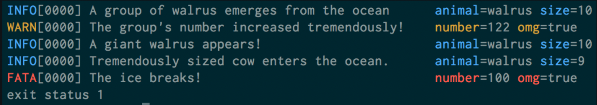

# juno


[](https://goreportcard.com/report/github.com/NethermindEth/juno)

[](https://github.com/NethermindEth/juno/actions)

[](https://codecov.io/gh/NethermindEth/juno)

Juno is a StarkNet client written in Go.

[Docs](https://nethermindeth.github.io/juno/)

Here you will find various links to help you start with the StarkNet ecosystem.

[StarkNet Docs](https://starknet.io/)

[Voyager block explorer](https://voyager.online)

[Warp Docs](https://github.com/NethermindEth/warp)

[CairoLang Docs](https://www.cairo-lang.org/)

[StarkEx Docs](https://docs.starkware.co/starkex-v4)

[StarkNet Devs Discord](https://discord.com/invite/uJ9HZTUk2Y)

[StarkNet Shamans Forum](https://community.starknet.io/)

[StarkNet Medium](https://medium.com/starkware/starknet/home)

[StarkNet Twitter](https://twitter.com/Starknet_Intern)

[Nethermind Twitter](https://twitter.com/NethermindEth)

## Logging 

For logging we use [logrus](https://github.com/Sirupsen/logrus). This library has 7 levels of logging: Debug, Info, 
Warning, Error, Fatal and Panic.
For example:
```go
package main

import log "github.com/sirupsen/logrus"


func main() {
	log.Trace("Something very low level.")
	log.Debug("Useful debugging information.")
	log.Info("Something noteworthy happened!")
	log.Warn("You should probably take a look at this.")
	log.Error("Something failed but I'm not quitting.")
	// Calls os.Exit(1) after logging
	log.Fatal("Bye.")
	// Calls panic() after logging
	log.Panic("I'm bailing.")
}
```

Use `import log "github.com/sirupsen/logrus"` instead `import "log"`.

It also allows us to add fields to the outputs, like this:

```
  log.WithFields(log.Fields{
    "animal": "walrus",
    "size":   10,
  }).Info("A group of walrus emerges from the ocean")

  log.WithFields(log.Fields{
    "omg":    true,
    "number": 122,
  }).Warn("The group's number increased tremendously!")

  log.WithFields(log.Fields{
    "omg":    true,
    "number": 100,
  }).Fatal("The ice breaks!")
```

Resulting in an output like this:



For more details about logging just go to [logrus](https://github.com/Sirupsen/logrus).