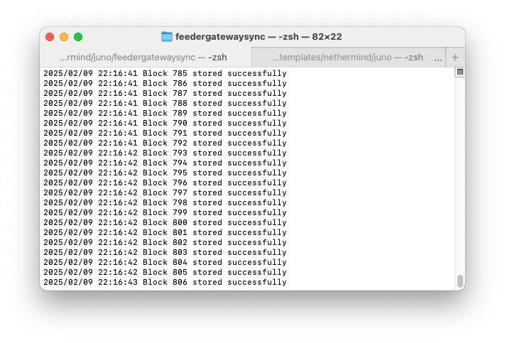

Here’s a concise **README** for understanding the `feedergatewaysync` sync package  

---

## Feeder Gateway Sync  

### Overview  
This package syncs **StarkNet blocks** (Sepolia Starknet) from the **Feeder Gateway API** and stores them in **PebbleDB**. It fetches block data, processes transactions, and ensures efficient storage.  

### Features  
- Fetches **blocks & transactions** from Feeder Gateway  
- Stores them in **PebbleDB** for persistence  
- **Graceful error handling** (skips failed blocks)  
- Logs progress with **success/failure tracking**  

### Run  
   ```sh
   cd feedergatewaysync
   go run cmd/main.go
   ```  

### Syncing Blocks  
Modify block range in `main.go`:  
```go
startBlock := 1
endBlock := 806
```
Expected output:  
```
Starting block sync...
Block 1 stored successfully
Block 2 stored successfully
...
Block 806 stored successfully
```


### Storage  
Blocks are **persisted in PebbleDB**, ensuring efficient data retrieval.  


---

**Author:** Deeptanshu Sankhwar